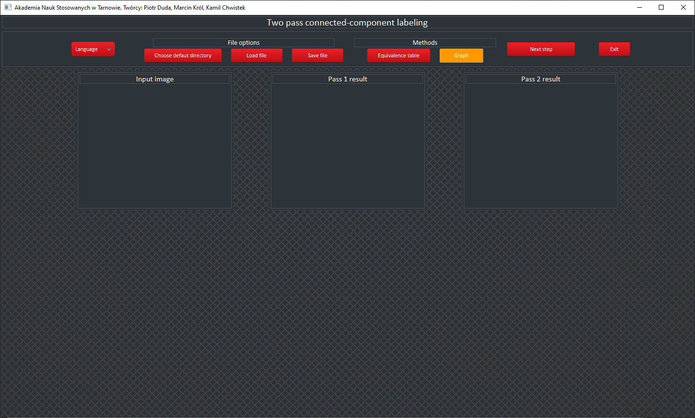
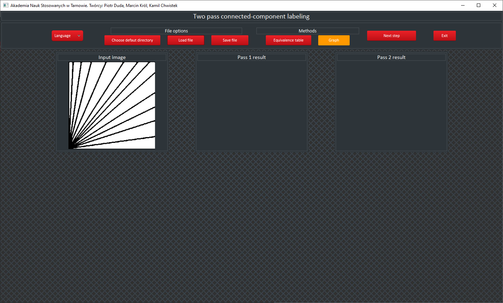
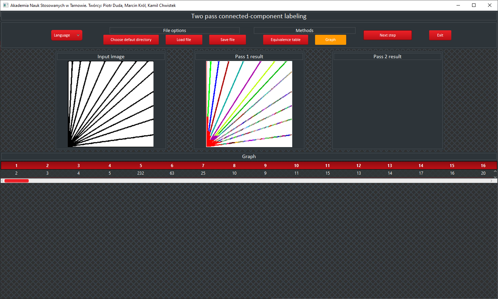
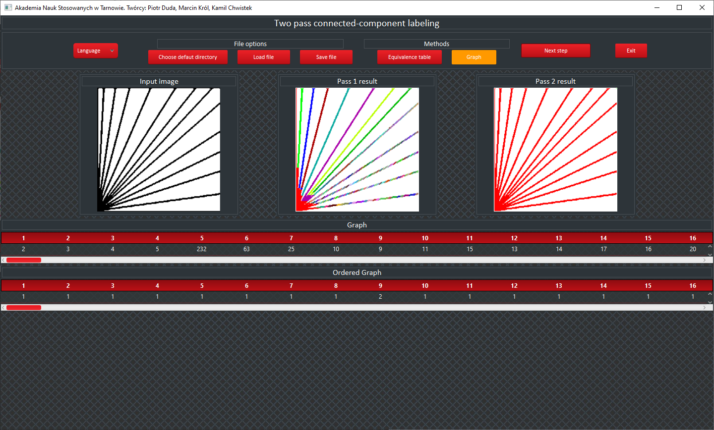
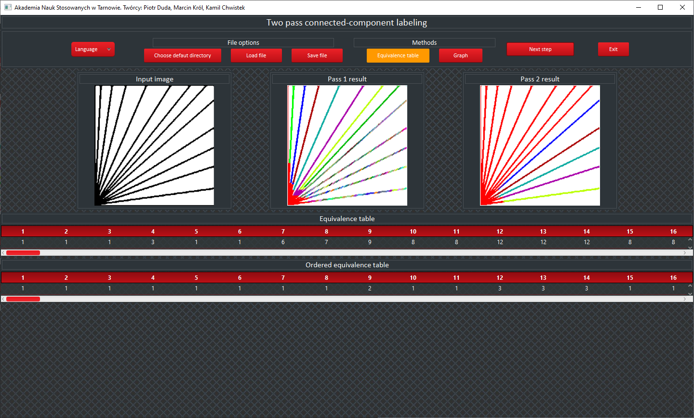

# Aplikacja Okienkowa umożliwiająca indeksację dwuprogową.

# Wstęp 
Aplikacja została napisana z użyciem technologii Java oraz JavaFX. Aplikacja została zrealizowana we współpracy z Peter022000 (Piotr Duda) w ramach projektu na studia.

# Udział
Za wygląd aplikacji w całości odpowiedzialny byłem ja natomiast logika została zaimplementowana przez Peter022000.

# Opis projektu
Aplikacja stworzona w Java FX umożliwia dwuprogową indeksację obrazków w odcieniach szarości za pomocą metod grafu i tabeli równoważności (equivalence table). Dwuprogowa indeksacja to technika przetwarzania obrazów, która pozwala na wydzielenie obszarów zainteresowania w obrazach na podstawie dwóch progów intensywności.

## Funkcje aplikacji:
- Wczytywanie Obrazów: Umożliwia użytkownikom wczytywanie obrazów w odcieniach szarości z lokalnego dysku.
- Wybór języka: Interfejs dostępny jest w języku angielskim oraz polskim.
- Indeksacja Dwuprogowa: Implementuje dwuprogową indeksację obrazów, pozwalając na identyfikację i oznaczenie obszarów zainteresowania.
- Metoda Grafu: Wykorzystuje strukturę grafu do śledzenia i oznaczania połączonych komponentów w obrazie. Metoda ta daje lepsze efekty od metody tabeli, co zaobserować można na zdjęciu 3.
- Tabela Równoważności: Używa tabeli równoważności do zarządzania i łączenia etykiet pikseli, co pozwala na efektywne grupowanie połączonych komponentów.

## Zastosowanie:
Aplikacja jest przydatna w różnych dziedzinach, takich jak analiza obrazów medycznych, przetwarzanie obrazów satelitarnych, oraz wszędzie tam, gdzie wymagane jest rozpoznawanie i analiza struktur w obrazach w odcieniach szarości.

Dzięki intuicyjnemu interfejsowi użytkownika stworzonemu w Java FX, aplikacja jest łatwa w obsłudze, a zaawansowane algorytmy przetwarzania obrazów zapewniają wysoką precyzję i efektywność indeksacji.

***

# Ekrany aplikacji

### Interfejs
<kbd></kbd>
***

### Wgranie zdjęcia testowego
<kbd></kbd>
***

### Pierwsze przejście wraz z tabelą - Metoda grafu
<kbd></kbd>
***

### Drugie przejście wraz z tabelą - Metoda grafu
<kbd></kbd>
***

### Oba przejścia wraz z tabelami - Metoda tabeli równoważności
<kbd></kbd>
***

# Technologie użyte w projekcie
- java
- javaFX
- maven

# Autorzy
Marcin Król, Piotr Duda
